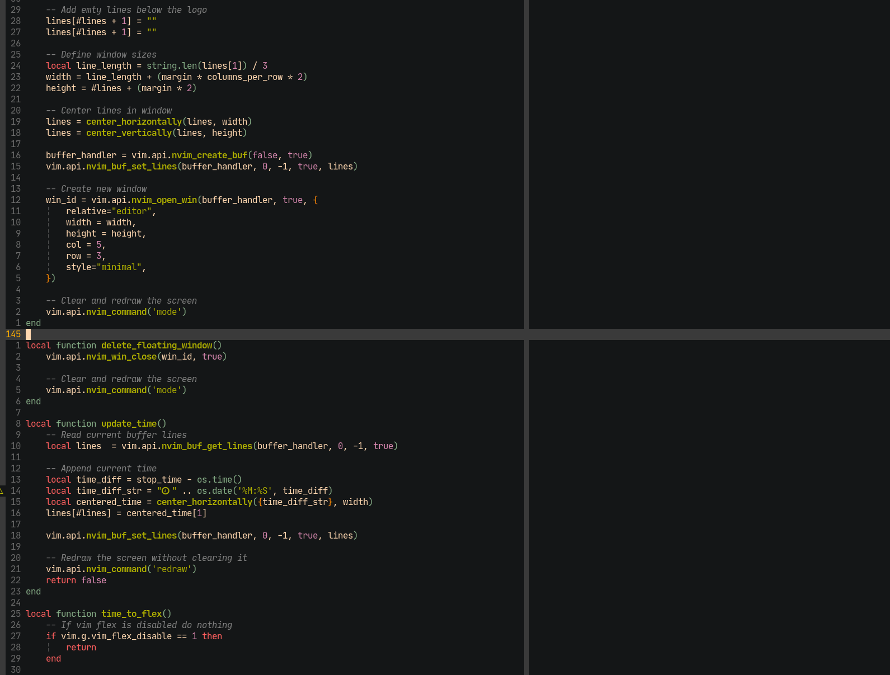

# Vim-Flex

*Carpal Tunnel Syndrome (CTS)* can be a developer's worst nightmare. Even though ergonomics play an
important role to keep us away from injuries, one of the most helpful actions we can do to prevent
*CTS* is to move our hands away from the keyboard and stretch often.

This plugin helps to remind you, with a notification window within nvim, that is *time to
flex!*

The notification will block your editor until the countdown finishes. Don't panic, you can still
unblock it if you have to, but I recommend you use the time to take care of your hands instead, and
then resume your great work.



## Install

```viml
Plug 'miguelmoraperea/vim-flex'
```

**Requires *nvim v0.5***

## Usage

Just fire nvim and get to work, this plugin will pop up a notification window when is
*time-to-flex!*.

If you need to unblock your editor just run *CTRL-c* and then *:q* to close the notification window
as usual.

## Configuration

The *interval* and *duration* of the notifications are configurable (i.e to set the notification
countdown to 2 minutes every 20 minutes):

```viml
let g:vim_flex_time_min = 2
let g:vim_flex_interval_min = 20
```

If you wish to disable *vim-flex* without uninstalling it:

```viml
let g:vim_flex_disable = 1
```

## Status

- [x] Add *time to flex* notification.
- [x] Add support for the user to configure the notification countdown time.
- [x] Add support for the user to configure the notification interval.
- [ ] Add support to the countdown configuration to use seconds only or minutes + seconds.
- [ ] Add additional notifications, i.e *rest your eyes*, *check your posture*, *switch to
  stand/sit*, etc.
- [ ] Add support for the user to configure the size of the notification window (i.e full-screen
  or width/height)

## Contributions

If you find this plugin useful and would like to make improvements, please by all means,
contributions are greatly appreciated!.
